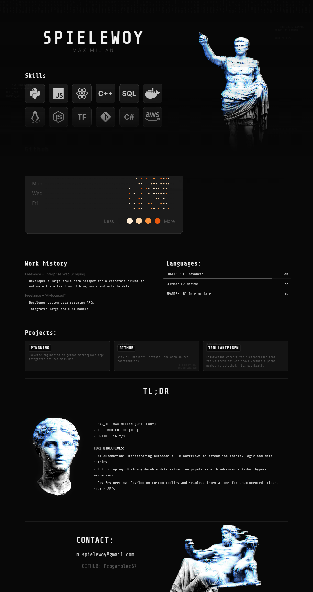

# Portfolio - Spielewoy Maximilian

A personal portfolio website showcasing my skills, projects, and a unique cyberpunk/glitch aesthetic.



## Overview

This is a static, single-page portfolio website designed to be visually striking and performant. It features a dark, modern theme with custom CSS animations, glitch effects, and responsive design.

### Key Features
*   **Custom Aesthetic:** Dark theme with green accents, CRT TV scanline effects, and glitch animations on text and images.
*   **Interactive Elements:** CSS hover effects and interactive components.
*   **Responsive Layout:** Adapts to different screen sizes.
*   **GitHub Integration:** Simulates a GitHub contribution graph.

## Technologies Used
*   **HTML5** for structure
*   **CSS3** for styling, animations, and custom aesthetic effects
*   **JavaScript** for interactive elements

## Setup
Because this is a static website, you can view it simply by opening `index.html` in any modern web browser. 

Alternatively, you can serve it locally using a tool like `http-server`:
```bash
npx http-server
```
Then, open `http://localhost:8080` in your browser.
